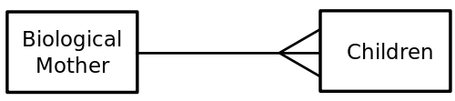

# SQL

## Learning Objectives

- Contrast relational and non-relational databases
- Create, set up, and seed a PostgreSQL.
- Execute SQL commands to perform CRUD actions.

## Framing

Today we are going to introduce a new paradigm for persisting data in our applications. Previously, we have used mongoDB as our database when building node applications. In fact, there are many alternatives. In this lesson we will contrast a new database management system, **PostgreSQL** a relational database, with mongoDB a non-relational database.

## Review Questions

<details>
<summary>What is a database and why would we use one?</summary>
<br>

> A database is a tool for storing data. It offers many advantages to storying in a text or binary file:

- **Permanence:** Our data is safe and won't be altered or deleted. 
- **Speed:** Databases are fast! They can be thousands of times faster than reading from a file.
- **Consistency:** Databases can enforce rules that keep data uniform.
- **Scalability:** Databases can handle lots of requests per second and many are built to scale by replicating and syncing information across multiple databases
- **Querying:** Databases make it easy to search, sort, filter, and combine data using a Query Language.

</details>

<details>
<summary>What is an ERD and why would we use one?</summary>
<br>

> An **Entity Relationship Diagram** is a tool to visualize and describe the data and relationships of our programs.

</details>

<details>
<summary>How would you represent a one to many relationship?</summary>
<br>



</details>

<details>
<summary>What is a schema?</summary>
<br>

> A schema is a blueprint of how your data is organized and how your database is structured. **It introduces consistency to our data.**
>
> In mongoose schemas looked like this:
```js
const CandidateSchema = new mongoose.Schema({
  name: String,
  year: Number
})
```

</details>

<details>
<summary>In what format is data in a mongoose database stored?</summary>
<br>

> Data in a non-relational database like mongodb is stored as JSON. It looks like this:

```js
{
   "_id" : ObjectId("54c955492b7c8eb21818bd09"),
   "address" : {
      "street" : "2 Avenue",
      "zipcode" : "10075",
      "building" : "1480",
      "coord" : [ -73.9557413, 40.7720266 ],
   },
   "borough" : "Manhattan",
   "cuisine" : "Italian",
   "grades" : [
      {
         "date" : ISODate("2014-10-01T00:00:00Z"),
         "grade" : "A",
         "score" : 11
      },
      {
         "date" : ISODate("2014-01-16T00:00:00Z"),
         "grade" : "B",
         "score" : 17
      }
   ],
   "name" : "Vella",
   "restaurant_id" : "41704620"
}
```

</details>

## Relational vs Non-Relational | PostgreSQL vs MongoDB

Non-Relational or *noSQL* databases have existed in some form for decades, however their use didn't become wide spread until recently. noSQL databases became an important alternative to relational databases in the early 2000s as companies like Facebook, Google, and Amazon's data storage needs changed and expanded. With the rise of social media and online marketplaces like eBay, the amount of data on the internet boomed. User were not only getting information from the internet, they were contributing to it. This transition stressed the capabilities of relational databases due to the volume and variability of user-generated data.

noSQL databases **historically and generally** offer more flexibility and scalability than traditional relational databases. However, they come with the cost of reduced consistency.

> **NOTE: Many of the distinctions between relational and non-relational databases are becoming blurred.** While relational and noSQL databases have fundamental differences and each have pros and cons, modern technology is bridging the gap through innovations that combat the weaknesses of each model.


### MongoDB is non-relational (noSQL)

MongoDB is document based. Meaning, data is organized in collections of related documents formatted in JSON.

#### Key Advantages

##### Usability

- Documents (i.e. objects) correspond to native data types in many programming languages
- Schema-less, documents can contain data that is variable, no need for migrations

##### High Performance

- Documents can be embedded in one another reducing the need for joins.
- Simple queries are very fast

##### High Availability

MongoDB's uses replica sets by default

- automatic failover, if data is mistakenly destroyed, it's backed up elsewhere
- data redundancy can increase speed of read requests

##### Automatic Scaling

- Sharding distributes data across a cluster of servers
- Replica sets provide low-latency high-throughput deployments

### PostgreSQL is relational (SQL)

PostgreSQL is a relational database management system. There are many others like MySQL and SQLite. They are all queried using **SQL. In a relational database, data is stored in tables.

#### What is a Relational Database?

##### Data is stored in tables

- tables are organized by columns and rows (imagine a spreadsheet)
- tables are named according to what they model (e.g., `artists`, `songs`)
- In the case of `artists`, each row represents one artist
- Each column is called an **attribute** or **field**, such as `id`, `title`, or `birth_year`
- users are required to create schemas before data can be stored

##### Queries are made via SQL (Structured Query Language)

- SQL is a database language used specifically for relational databases
- SQL is great for reliably managing complex queries

##### Data is related between tables

- we can relate rows in the `songs` table to rows in the `artists` table
- to relate data we use `keys` that are unique identifiers for each row of a table.

#### Lets Talk Terminology


**Database:** The actual set of data being stored

- We may have multiple databases for an application

**Database Language:** The language used to interact with a database

- With relational databases, we use SQL
- There isn't a standard language across noSQL databases

**Database Management System (DBMS):** The software that lets a user interact (query) the data in a database

- relational examples include PostgreSQL and MySQL
<details>
&emsp;<summary>What DBMS did we use when building MERN apps?</summary>
<br>

> Mongoose!

</details>
<br>

**Database CLI:** A tool offered by most DBMSs that allow users to query the database from the command line

- we will use one called `psql` for PostgreSQL
<details>
<summary>What was the mongoose equivalent?</summary>
<br>

> The mongo shell

</details>


### Basics of Databases, and SQL

#### Concepts

- Explain how a database, a database management system (DBMS) and SQL relate to one another
- Describe a database schema and how it relates to tables, rows and columns

#### Mechanics

- Create a new PostgreSQL database
- Set up a PostgreSQL database schema with a saved SQL file
- Seed a PostgreSQL database with a saved SQL file
- Execute basic SQL commands to execute CRUD actions in a database

### Relationships in SQL / SQL JOINs

- Define what a foreign key is
- Describe how to represent a one-to-many relationship in SQL database
- Explain how to represent one-to-one and many-to-many relationships in a SQL DB
- Distinguish between keys, foreign keys, and indexes
- Describe the purpose of the JOIN
- Use JOIN to combine tables in a SELECT
- Describe what it means for a database to be normalized


###

## Framing

This lesson is broken down into three parts...

1. [Domain Modeling & ERDs](erd_domains.md)
2. [Basics of Databases and SQL](sql_basics.md)
3. [Relationships in SQL](sql_relationships.md)

## Sample Quiz Questions

* What is the distinctive feature of a relational database?
* How is information stored in a relational database?
* What are the different types of relations that exist in a relational database?
* How do we indicate a one-to-many relationship in a database?

## Homework: [NBA Stats](https://github.com/ga-wdi-exercises/nba_stats)

## Practice

The following two resources are a great way to gain further familiarity with SQL. We fully expect this to be a challenge. If you're struggling on the homework, watch the Code School course on SQL and try the SQL for Beginners exercises before trying to finish the homework:

- [Code School Try SQL](https://www.codeschool.com/courses/try-sql)
- [SQL for Beginners](https://www.codewars.com/collections/sql-for-beginners/): Created by WDI14 graduate and current GA instructor Mike Nabil.
- [The official PostgreSQL Documentation](https://www.postgresql.org/docs/9.3/static/index.html) is also very good, in particular:
  - [The preface](https://www.postgresql.org/docs/9.3/static/preface.html)
  - [The official tutorial](https://www.postgresql.org/docs/9.3/static/tutorial.html)
  - [The overview of SQL](https://www.postgresql.org/docs/9.3/static/sql.html)

## Additional Practice

- [Postgres Guide](http://postgresguide.com/)
- [SQL Zoo](https://sqlzoo.net/)
- [W3 Schools SQL tutorial](https://www.w3schools.com/sql/)
- [SQL Course](http://www.sqlcourse.com/)
